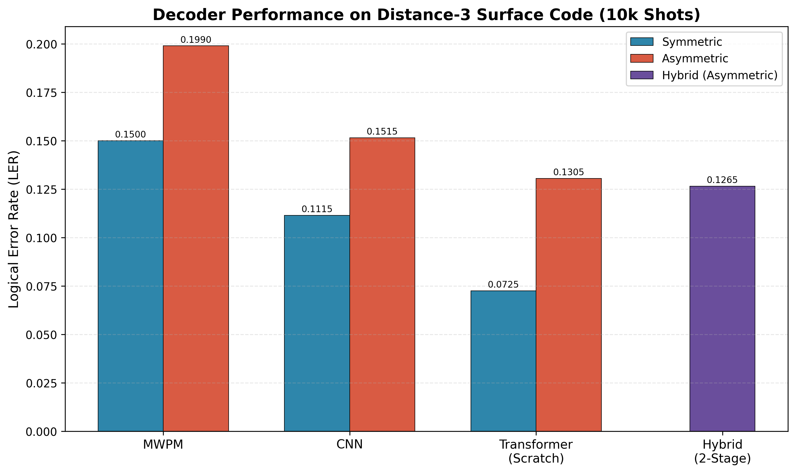
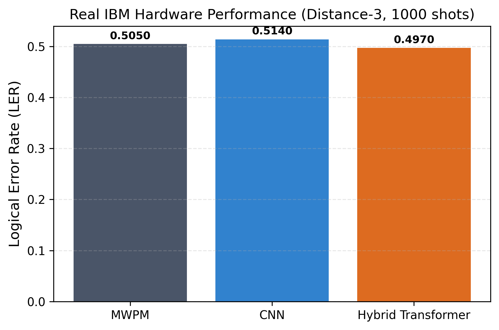
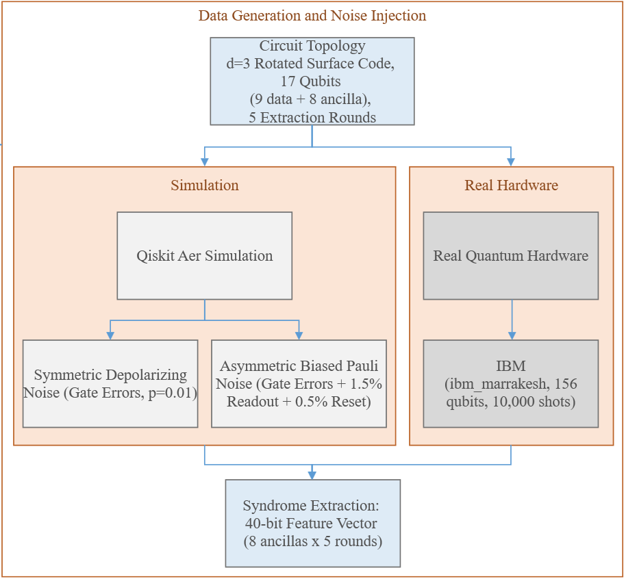
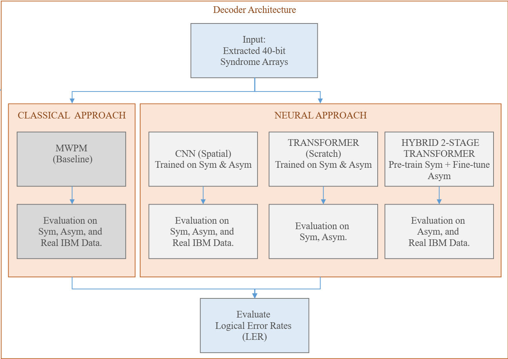

# Neural vs. Classical Decoders for the Surface Code

Benchmarking MWPM against CNN, Transformer, and a two-stage Hybrid Transformer decoder on a distance-3 rotated surface code under simulated noise and real IBM hardware.

## Overview

In quantum error correction, a **decoder** is the algorithm that reads the error syndromes measured from a quantum circuit and figures out which physical errors most likely occurred, so they can be corrected. Quantum computers need logical error rates around 10⁻¹² to be useful, but today's physical qubits still err at roughly 0.1–1%. This project tests whether neural decoders can beat the classical industry standard, Minimum-Weight Perfect Matching (MWPM), under both ideal and realistic noise. Using a distance-3 rotated surface code (17 physical qubits, 5 syndrome extraction rounds), four decoders are compared: MWPM, a CNN, a Transformer trained from scratch, and a two-stage Hybrid Transformer that first learns lattice topology on symmetric noise, then fine-tunes on asymmetric hardware-like noise.

For the detailed analysis, see the report: [Esranur-Aygün-1904469-Final-Report-Quantum-Engineering.pdf](Esranur-Ayg%C3%BCn-1904469-Final-Report-Quantum-Engineering.pdf).

## Repository Structure

```
AlphaQubit-Neural-Decoding/
│
├── README.md
├── requirements.txt
├── Esranur-Aygün-1904469-Final-Report-Quantum-Engineering.pdf
│
├── Architecture/                                # Pipeline diagrams
│
├── 01_Data_Generation_Simulated.ipynb
├── 02_Data_Generation_IBM_Hardware.py
├── 03_MWPM_and_Transformer_Training.ipynb
├── 04_CNN_Training.ipynb
├── 05_Evaluation_Simulated.ipynb
├── 06_Evaluation_Real_Hardware.ipynb
│
├── data/          # Features and labels (.csv)
├── models/        # Trained network checkpoints (.pth)
└── results/       
```

## Methodology

- **Circuit**: Distance-3 rotated surface code with 17 physical qubits (9 data, 8 ancilla) over 5 syndrome extraction rounds. Each shot produces a 40-bit syndrome vector (5 rounds × 8 ancillas) plus a 1-bit logical label.
- **Symmetric depolarizing noise** (10,000 shots): X and Z errors at equal rates. Used for pre-training so models learn the surface code's topology.
- **Asymmetric Pauli noise** (10,000 shots): Biased toward X-flips with 1.5% measurement error and 0.5% reset error, mimicking qubit relaxation on real hardware. Used for fine-tuning.
- **IBM hardware data** (1,000 shots): Real syndrome data from the 156-qubit `ibm_marrakesh` processor, collected via the SamplerV2 primitive to capture raw probability outcomes.
- **Decoders**:
  - **MWPM (baseline)** — PyMatching builds a mathematical detection graph; no training needed.
  - **CNN** — learns local spatial error patterns from the syndrome grid.
  - **Transformer (from scratch)** — self-attention model trained directly on both noise datasets, as a control.
  - **Hybrid 2-Stage Transformer** — pre-trained on symmetric noise to learn topology, then fine-tuned on asymmetric noise to adapt to physical biases.

## Pipeline Diagrams

| Figure | Description |
|--------|-------------|
|  | Data generation: surface code circuit, noise injection, syndrome extraction to 40-bit readout tensors |
|  | Decoder training and evaluation pipeline across MWPM, CNN, Transformer, and Hybrid Transformer |

## Results and Findings

### Final Decoder Evaluation (Distance-3)

| Decoder Architecture         | Symmetric Noise | Asymmetric Noise | IBM Hardware |
|------------------------------|-----------------|------------------|--------------|
| MWPM (Classical)             | 15.00%          | 19.90%           | 50.50%       |
| CNN                          | 11.15%          | 15.15%           | 51.40%       |
| Transformer (Scratch)        | **7.25%**       | 13.05%           | —            |
| Hybrid 2-Stage Transformer   | —               | **12.65%**       | **49.70%**   |

### Findings

- **MWPM struggles when noise is biased.** Its LER jumps from 15.00% (symmetric) to 19.90% (asymmetric) because its fixed graph can't account for correlated errors.
- **Two-stage training wins in simulation.** The Hybrid Transformer gets the lowest asymmetric-noise LER at **12.65%** — 7.25 points better than MWPM.
- **A plain neural net isn't enough.** The CNN actually does *worse* than MWPM on `ibm_marrakesh` (51.40% vs. 50.50%). It learned simulated spatial patterns but didn't generalize to real hardware noise.
- **The Hybrid model transfers.** On the IBM processor it holds the lowest LER at **49.70%**, beating MWPM by 0.80 points — a small gap, but that kind of margin matters in fault-tolerant systems.
- **Bottom line:** the two-stage approach (topology first, hardware bias second) is what lets neural decoders beat classical graph algorithms on real hardware.

### Result Figures

| Figure | Description |
|--------|-------------|
|  | Simulated LER across decoders (10,000 shots) |
|  | Real IBM hardware LER (1,000 shots) |
|  | Noise injection pipeline visualization |
|  | Decoder evaluation pathways |

## How to Run This Code

### 1. Environment Setup

Install dependencies:

```bash
pip install -r requirements.txt
```

### 2. IBM Quantum Setup

To run the live processor script (`02_Data_Generation_IBM_Hardware.py`), you need your IBM Quantum credentials:

- Open the script and find the config variables at the top
- Paste your personal access token into `IBM_TOKEN = "YOUR_TOKEN_HERE"`
- Fill in your cloud resource instance name in the parameter fields below it

### 3. Execution Sequence

Run the notebooks in order, 01 through 06.

**File placement:**
- The `.csv` files from generators 01 and 02 need to sit in `/data/` so notebooks 03 and 04 can read them
- Trained `.pth` checkpoints need to be in `/models/` before running evaluations 05 and 06

**Note:** Simulator data is deterministic under fixed seeds. Real hardware output will drift a bit across job runs due to physical quantum noise.

## Citation

If you use this work, please cite:

```bibtex
@misc{aygun2025quantumdecoders,
  author       = {Esranur Ayg{\"u}n},
  title        = {Neural vs. Classical Decoders for the Surface Code: From Simulation to IBM Quantum Hardware},
  year         = {2025},
  howpublished = {\url{https://github.com/fukichime/quantum-noise-decoder-comparison}},
  note         = {Department of Computer Engineering, Bah\c{c}e\c{s}ehir University}
}
```

### Key References

- **Surface code foundations** — Dennis, Kitaev, Landahl, Preskill, *Topological Quantum Memory*, J. Math. Phys. 2002.
- **Practical surface code** — Fowler et al., *Surface Codes: Towards Practical Large-Scale Quantum Computation*, Phys. Rev. A 2012.
- **AlphaQubit** — Bausch et al., *Learning High-Accuracy Error Decoding for Quantum Processors*, Nature 2024.
- **PyMatching** — Higgott & Gidney, *Sparse Blossom: Correcting a Million Errors per Core Second with Minimum-Weight Matching*, Quantum 2025.
- **Neural decoding on IBM hardware** — Hall, Gicev, Usman, *Artificial Neural Network Syndrome Decoding on IBM Quantum Processors*, Phys. Rev. Res. 2024.

## License

See [LICENSE](LICENSE) for details.
